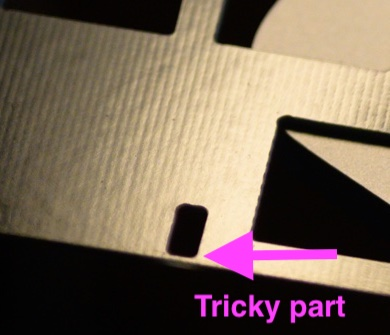
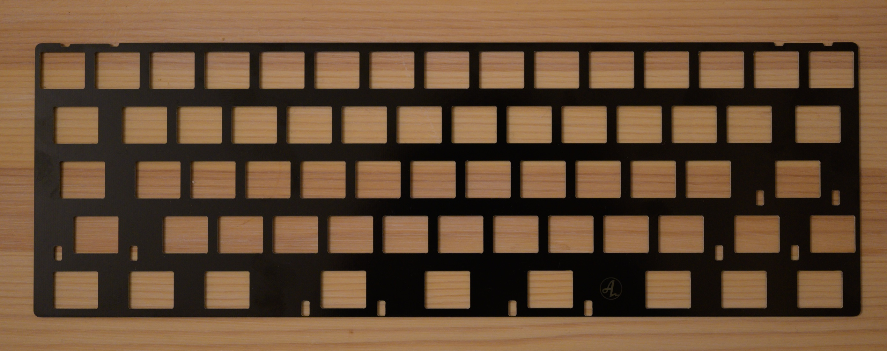
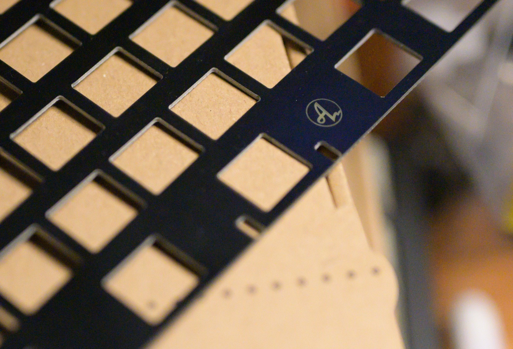
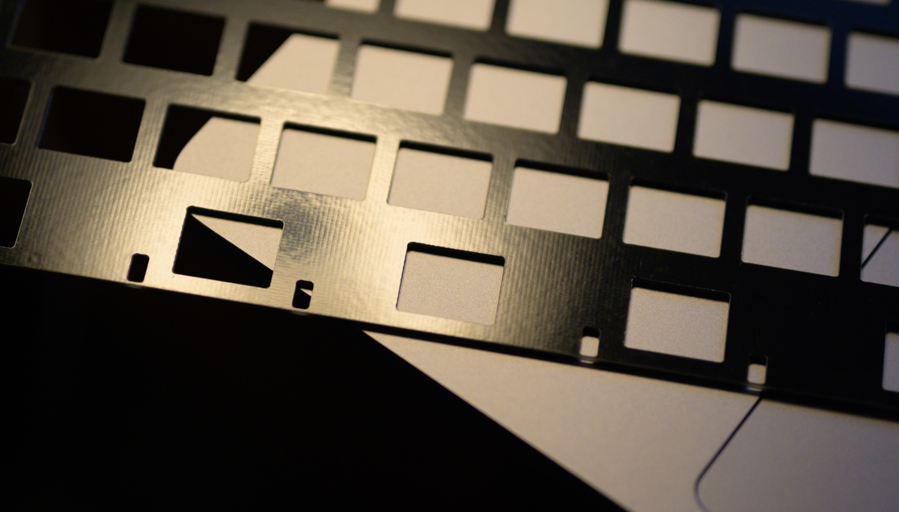
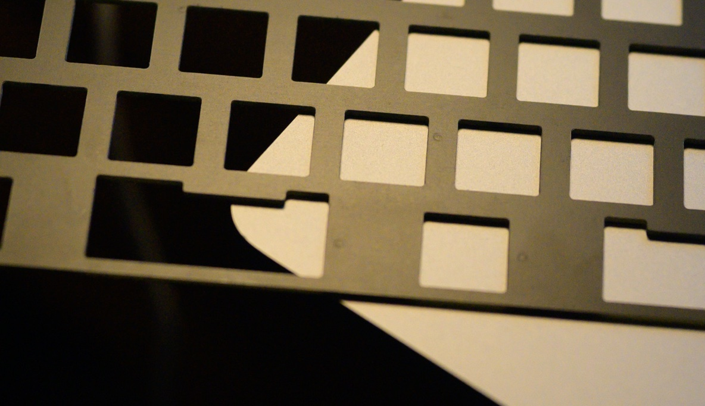
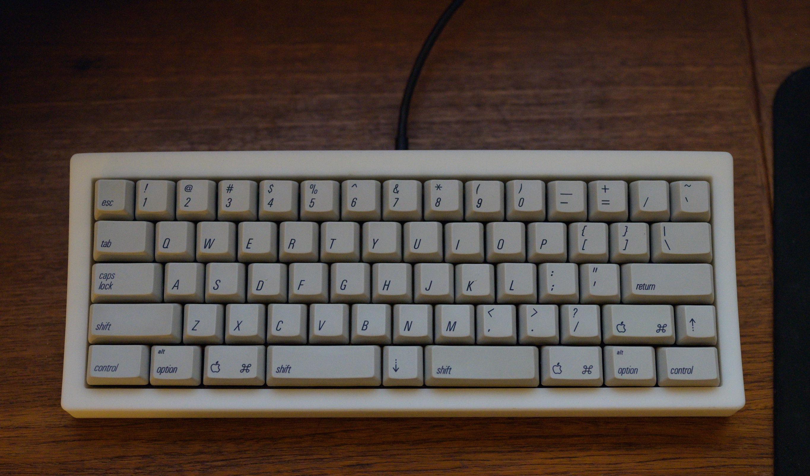

## 2021-10 Sponsored plate from PCBWay
PCBWay kindly offered sponsorship of a free PCB, I've been looking for places to do 60% alps plates. This is not without issue, some manufacturers wont do them due to the very thin parts that is left when milling out the stabilizer cutouts. I've had situations before where for example JLC won't make the plates due to this. I'm pretty sure they've updated their view on plates since then. Whith this in mind, I asked PCBWay to do a HHKB-layout, split space ALPS plate for AEK keycaps.

**The hard part:**

This part at the space stabilizer gets very thin and can potentially cause issues or break.

There is not as much to evaluate on a order of plate, the things to note:
- Milling accuracy
- Overall quality and feel
- Communications with the FAB.

Milling accuracy seems good, I've made a test build that I'm currently writing on. Switches and stabilizers fit well. Plates are not super critical. 

Opening for logo in soldermask look good.

Finnish, and quality seems good. Nothing super extra or bad, pretty standard, no notable scuffs or marks. The soldermask seems a bit thinner than for example the JLC soldermask. You can spot the weaving of the FR4 fibers in the right light, not sure if this also is the case with the matte black options.

**PCBway Black:**

**JLC Matte Black:**

Communication with the fab is generally very good with PCBWay in my opinion, if there is something that's not clear, they ask.

I also ordered a test-print of a case I'm working on, so I did a test-fit using the plate. Case turned out a bit warped, so I'll do a CNC'd version instead.

Overall, I'm happy with the result. I'll very likely do more 60% ALPS plates from them. Let me know if you have any questions regarding this. 

Site: https://www.pcbway.com/
