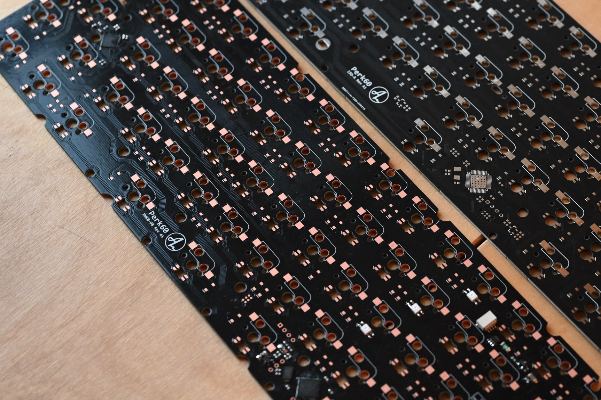
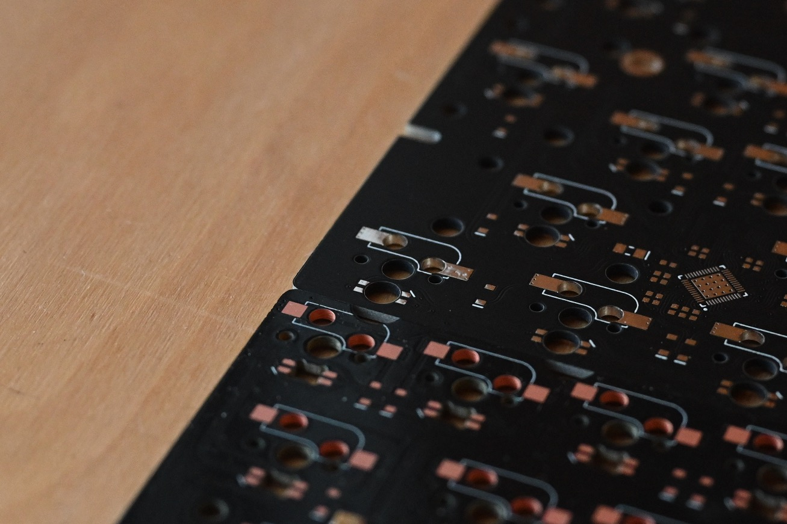

 ## 2022-06 Sponsored PCB from PCBWay
PCBWay kindly offered sponsorship of a free PCB, I've been curious about OSP surface finish for a while, so I thought I'd do a set of protos and test this out, since this is a finish they offer for their standard/basic pool. 

Site: https://www.pcbway.com/

### Why OSP?
What I find compelling about OSP is mainly the fact that it's a enviromentally friendly finish that's both cost effective and gives a nice/cool look. In theory, OSP gives a very flat surface with good solderability that should give a similar result as HASL.

One of the main drawbacks is the shelf life and durability of the surface while working with the board (during assembly). HASL and ENIG which is often used with keyboard PCBs are very strong surfaces with good shelf life.

- You can read more about OSP here: https://blog.optimumdesign.com/pcb-surface-finishes-comparison-hasl-osp-enig
- PCBWay also did a cute little video about OSP: https://www.youtube.com/watch?v=2gR6F79ffyo

Since the durability and shelf life drawback is befor assembly and during assembly, it's pretty much a non issue for a hot swap PCB. I'd like to do more testing in the future of how the pads hold up long term for a regular solder PCB.

## The PCB:
I had a PCB in the pipeline for proto, so I thought this would be a good fit. It's a perkey-rgb 60% (Perk60) that I'll try and make available in the future, either via vendor/stor or open source. I got the regular black PCB with OSP. I generally prefer matte black sodlermask to the shiny black, but it looks pretty good I'd say. The OSP finish has a very nice look. It's a lot darker than HASL, as you'd expect, it's more of a copper color compared to the golden color of ENIG.

I've soldered two complete protos and partially assembled the remaining. From my findings, it has very good solderability. It feels and behaves very similar to a ENIG PCB in my experience. If using OSP can reduce the enviromental footprint a bit and with a similar result as ENIG, I find it very interesting. I'm not sure I'd be as quick to use this for solder PCBs, but I'll definately look into using OSP for future hotswap PCBs at the very least.

As compared to HASL it's of course a much flatter surface as shown below

Thanks to PCBWay for alowwing me to do these little protos and tests!

