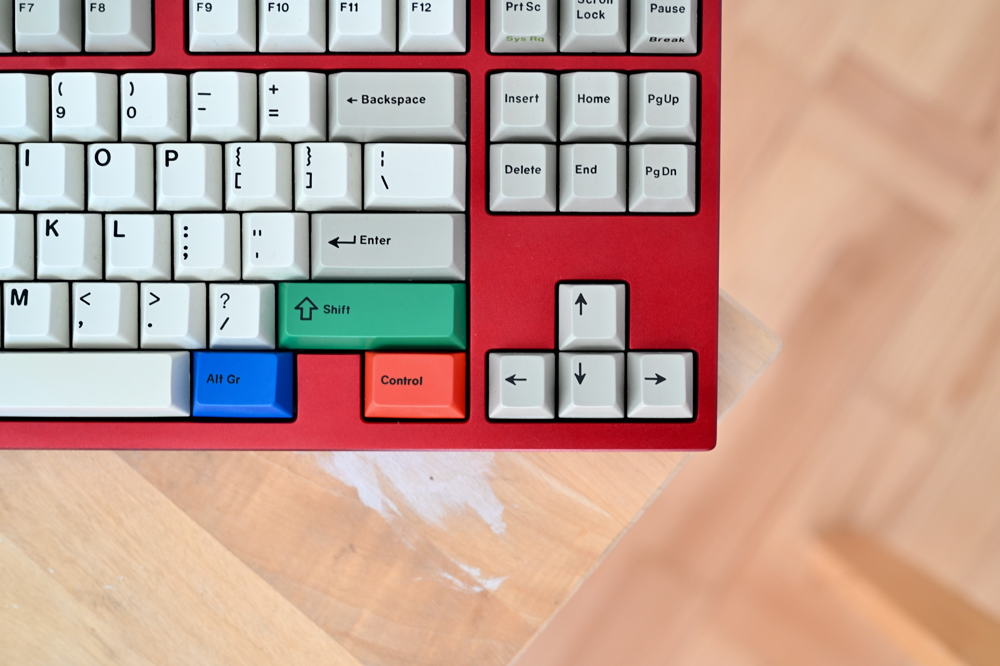
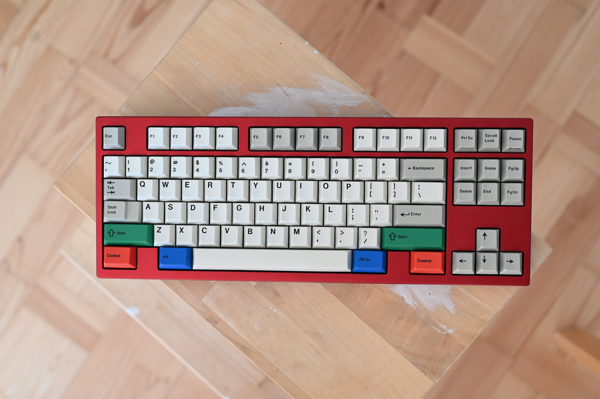
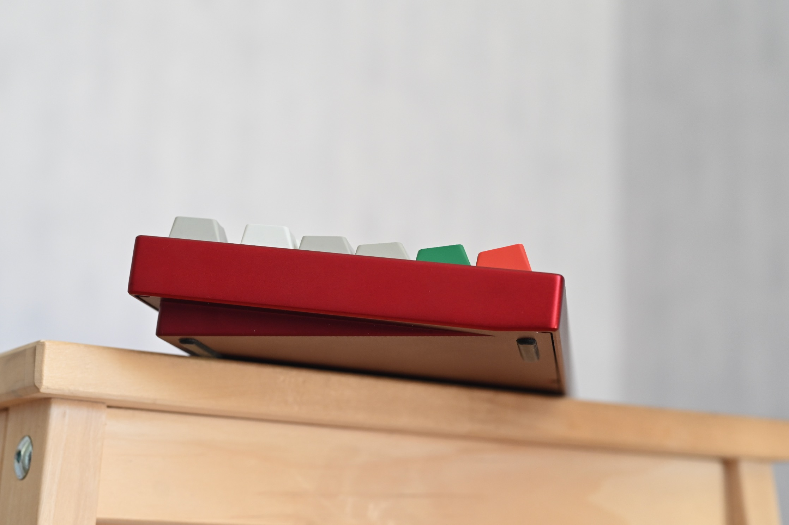
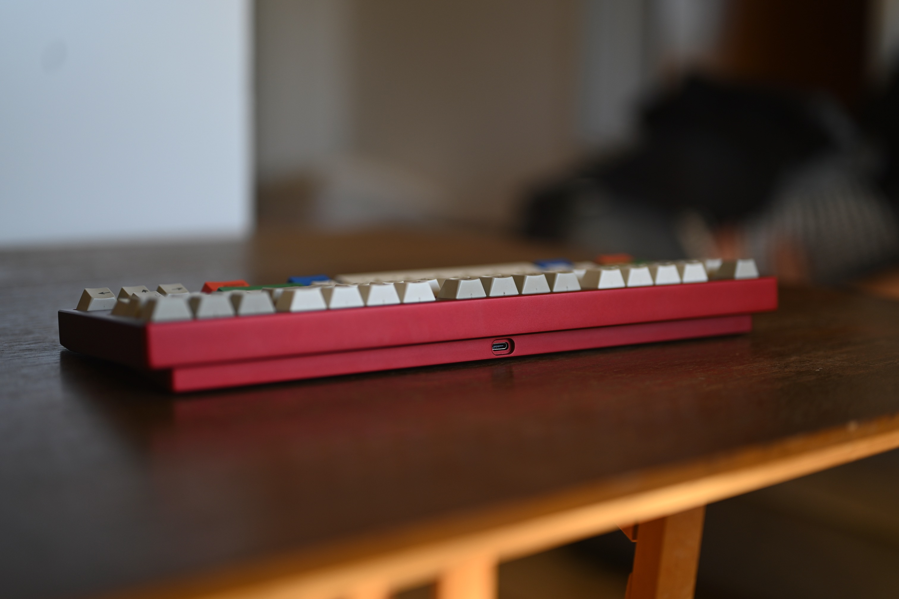
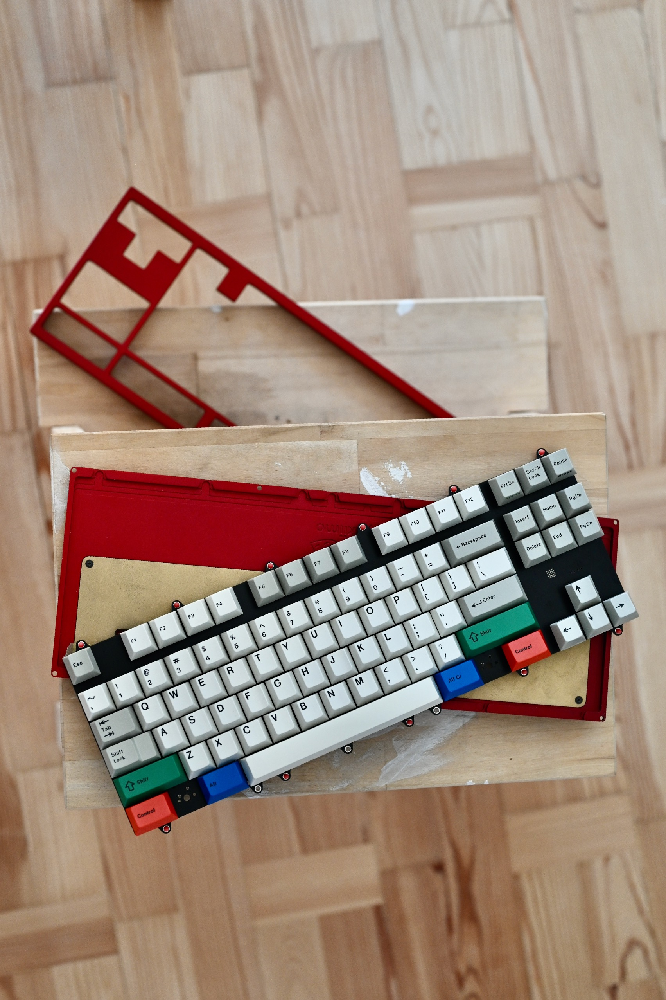
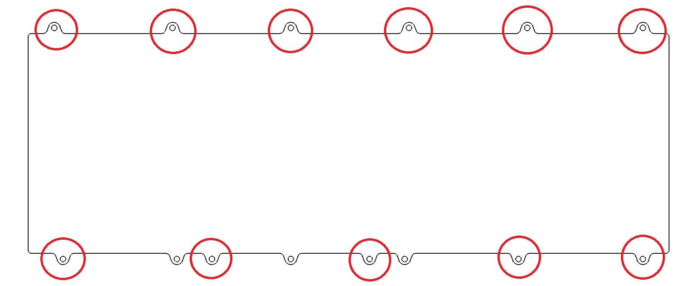
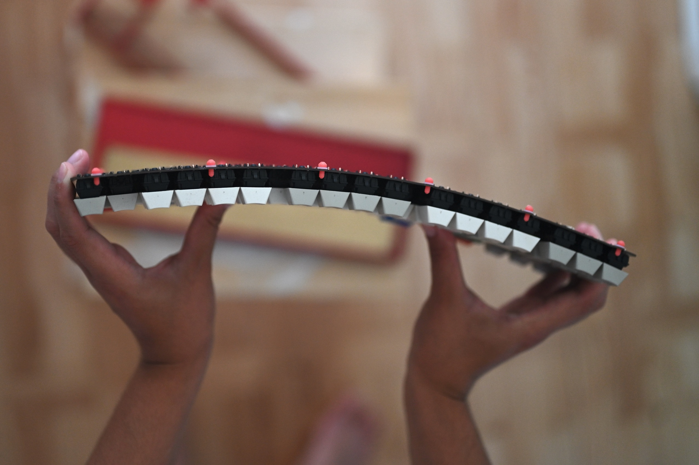
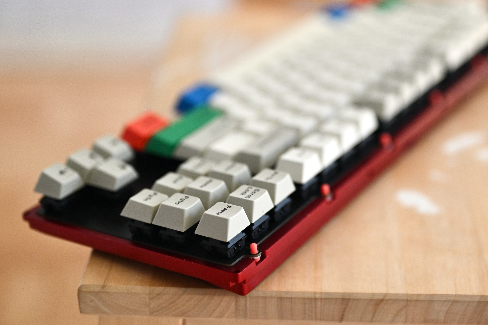
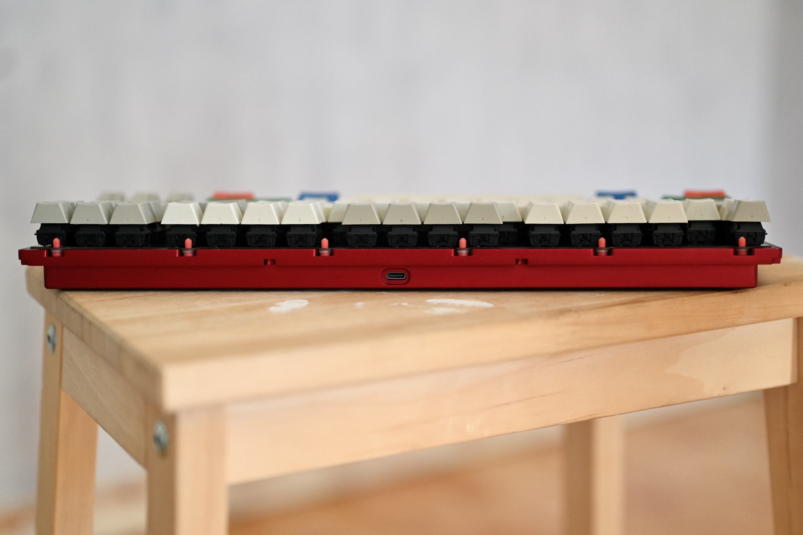

**Loading wall of text: ###########**

**Done:**

Ok, so I've had this case for a while waiting for me to do a proper test build, try it out and do a proper evaluation. Scroll to the end for tlrd.

Amazing work by Peppy, Kkatano and GEON, thanks for having me in this project. It's been really fun :D

- Kkatanos write up here: https://docs.google.com/document/d/1_HHvs7NjZSkNIqXHGjIoR-9ly4jWUfoSscpuuVSIsT4/edit#heading=h.51iyt4p5r8w8

- Peppys write up here: https://www.notion.so/Prototype-R1-thoughts-e21a032653704151b684763faae4468d

I’d recommend to read them in the order they’ve been published. First Kkatanos, then Peppys and lastly mine.

The case and PCB was done in two different variations. They are highlighted in more detail in Kkatanos writeup. I have the *"Proto A"* with slight variations compared to *"Proto B"* that Peppy has. I'll give my input based on the proto I have. Some of the things I mention, I know is different on Peppys board and more changes is planned for change in the future.

# Building experience and overall construction

I love the simplicity of this case. It's easy to build and due to the plateless nature, very easy to modify and change for example if a stab needs tuning or develop a problem. It really is a no nonsense and clean project. I might be a bit biased, but **I really like it**.

Anno and surface finish is good aside from a few defects (spots of lighter color). Really liking the burgundycolour. I think it fits the project with the deep red a sweet potato can be, I also think a dark-ish purple could fit for the same reasons.

I accidentally built it with the spacers on the wrong side of the PCB at first as you can see in the pics. Luckily, Kkatano has a good note about this ^^

# Tad pole placements and PCB thickness

This will be a matter of preference. I usually like medium flex builds and generally don't build anything far outside of the norm.

First I built this case with the 1.6mm PCB. It feels good and uniform, but I feel it's a lot more lively and fun with the added flex from the 1.2mm. This also gives it a slightly less uniform feel, but I still prefer this. I let a few people test the difference between the 1.6mm PCB and the 1.2mm PCB, most prefered the softer feel of the 1.2mm PCB.

I found using these tadpole positions gave me the most uniform feel and best typing experience:

For my personal preference, I'd go with the 1.2mm PCB and the circled positions above.

The flex is bigger at the edges, so mods will flex more (not a big surprise). I'm currently using the 60A hardness and I think they are a good fit. The flex at the enter key is similar to the flex at capslock. Due to the construction, it'll flex a tiny bit more at the caps lock, since it's at the edge of the PCB, but i did not find it to be noticeable while typing. Overall a very soft typing feel, cozy like a steaming Yakiimo? ;) My recommendation is that we decide on using only the 1.2mm PCB.

# Case clearance and proto A vs proto B

Peppy also touched on this, so I'll not go into the specifics of the clearance and distances etc. It’s well illustrated by Peppy in his write up.

In regards to Peppys note about the spacebar and mounting posts and my own experience, I believe the proto I received that has the option of a tighter placement of tadpoles adjacent to tha spacebar is best. I can't say much about the other differences in mounting post placements, but I don't think they will have a massive difference. 

Overall, I think the placements of the tadpoles work well. The main point of excessive flex will be at the center of the short sides (for example caps lock position) and I guess that the flex there is similar in both versions.

Other design differences to be evaluated between A and B:
- Sandblasted weight is perfectly fine in my opinion
- Logo looks good in the proto I received

# Typing feel and sound

Typing sound is pretty muted, especially mods and spacebar. Poppy boards tend to have a loud onion chopping sound from the spacebar which is not my favorite. I was pleased that I liked the sound of the mods and space on this project.

With GMK keycaps it's a mild clacky sound and with XMI it's a more poppy sound. I like the slightly more lively sound of the GMK clack between the two.

A heavy typist might have issues with the amount of flex and bottom out. For me, this is not an issue.

# Specs for the test build:

- **Switches:** Cherry Hyperglide Blacks, stock
- **Keycaps:** OG Cherry doubleshots + GMK RGB mods and XMI V1 for comparison.
- **Stabs:** A bit assorted, but mostly cherry and old stabs that I think hammer produced way, way back.

For a proper build, I'd lube, spring swap and film the switches and use TX-stabs or regular cherry clip-ins. Stock Hyperglide spring is so bad, wow.

# Changes for future revisions:
We have discussed a few changes. I think the most important ones is:
- Adjusting clearances to keycaps as detailed in Peppys write up
- Finalizing tad-pole placements

For the other things discussed, check Kkatanos document. 

We did discuss the possibility to add a plate in the yakiimo-discussion channel. Personally I think it would be fun to be able to add a plate for SI/Alps/Topre builds in the future, but **only if it does not in anyway compromise the current tad-pole implementation** or cost. I see no reason to compromise the current design to add such features, it's better to do one design-concept well. As far as tad-poles go, I do think this was a good choice for the project.

# TLDR
- Sounds and feels muted and soft. No onion chopping spacebar!
- Simple and classic look
- Easy to build and tune (especially since there is no plate)
- Minor adjustments to case needed (covered by Peppy)

Thanks for reading!

